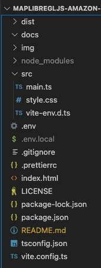

# maplibregljs-amazon-location-service-route-calculators-starter


Easily start routing with MapLibre GL JS and Amazon Location Service.  
- [MapLibre GL JS v4.0.2](https://maplibre.org)  
- [Amazon Location Service](https://aws.amazon.com/location)  
- node v20.0.0
- npm v9.6.4

<br>

## blog

[Building a Route Search Function with Amazon Location SDK and API Key Function](https://dev.to/aws-heroes/building-a-route-search-function-with-amazon-location-sdk-and-api-key-function-42im)

<br>

## Usage



<br>

Create Amazon Location Service "map", "API key(map)", "routing" and "API key(routing)"

- [API key creation (map)](https://memo.dayjournal.dev/memo/amazon-location-service-004)  
- [API key creation (routing)](https://memo.dayjournal.dev/memo/amazon-location-service-006)  

<br>

Set "region", "API key(map)", "map name", "API key(routing)" and "routing name" in env file
```env
VITE_REGION = xxxxx
VITE_MAP_API_KEY = v1.public.xxxxx
VITE_MAP_NAME = xxxxx
VITE_ROUTE_API_KEY = v1.public.xxxxx
VITE_ROUTE_NAME = xxxxx
```

<br>

Install package
```bash
npm install
```

<br>

build
```bash
npm run build
```

<br>

dev
```bash
npm run dev
```

---

<br>
<br>


<br>

## License
MIT

Copyright (c) 2024 MapLibre User Group Japan

<br>

---

<br>

### Japanese

<br>

# MapLibreGLJS & Amazon Location Service & ルーティング スターター


MapLibre GL JSとAmazon Location Serviceでルーティングを手軽に始める
- [MapLibre GL JS v4.0.2](https://maplibre.org)  
- [Amazon Location Service](https://aws.amazon.com/location)  
- node v20.0.0
- npm v9.6.4

<br>

## blog

[Amazon Location SDKとAPIキーでルート検索機能を構築](https://zenn.dev/mierune/articles/try-109-amazon-location-service)

<br>

##  使用方法


<br>

Amazon Location Serviceのマップ・APIキー(マップ)・ルーティング・APIキー(ルーティング)を作成

- [APIキー作成(マップ)](https://memo.dayjournal.dev/memo/amazon-location-service-004)  
- [APIキー作成(ルーティング)](https://memo.dayjournal.dev/memo/amazon-location-service-006)  

<br>

リージョン・APIキー(マップ)・マップ名・APIキー(ルーティング)・ルーティング名をenvファイルに設定
```env
VITE_REGION = xxxxx
VITE_MAP_API_KEY = v1.public.xxxxx
VITE_MAP_NAME = xxxxx
VITE_ROUTE_API_KEY = v1.public.xxxxx
VITE_ROUTE_NAME = xxxxx
```

<br>

パッケージインストール

```bash
npm install
```

<br>

ビルド

```bash
npm run build
```

<br>

開発

```bash
npm run dev
```

<br>
<br>


<br>

## ライセンス
MIT

Copyright (c) 2024 MapLibre User Group Japan

<br>
